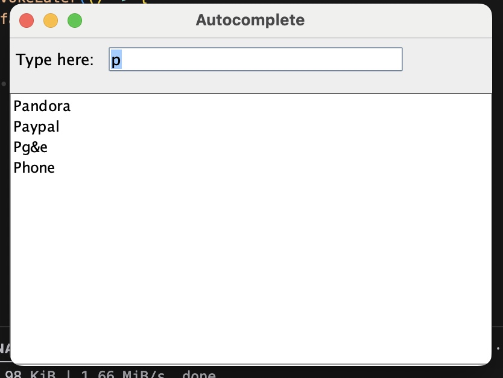
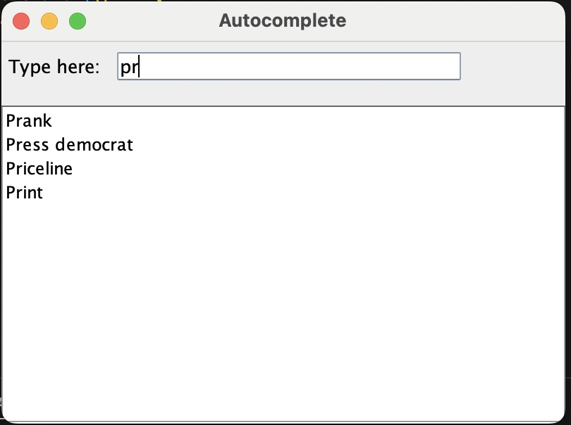
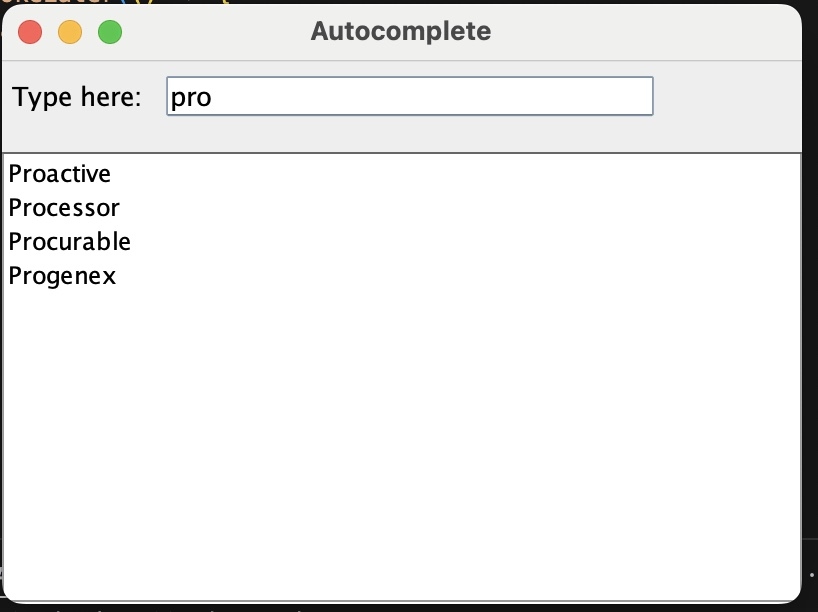
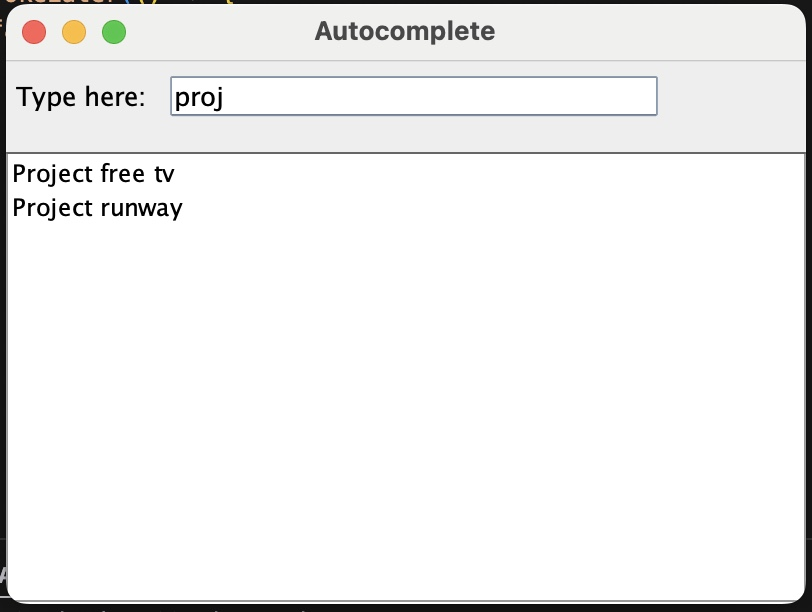

# Autocomplete

A simple Java application that suggests words as you type, similar to a search engine's autocomplete feature. The suggestions are sorted alphabetically.

## Features
- Shows up to 4 suggestions in alphabetical order
- Case-insensitive search
- Supports words with spaces and special characters
- Real-time suggestions as you type

## Prerequisites
- Java JDK 11 or higher
- JUnit 4 for running tests
- VS Code with "Extension Pack for Java" and "Test Runner for Java" or IntelliJ IDEA

## Project Structure

```plaintext
project/
├── src/
│ ├── main/
│ │ └── java/
│ │ ├── TextPredictor.java 
│ │ ├── UserInterface.java 
│ │ └── Main.java 
│ └── test/
│   └── java/
│       └── TextPredictorTest.java 
```

## Running the Application

### Using VS Code
1. Clone the repository
2. Open the project in VS Code
3. Run `Main.java`

### Using IntelliJ IDEA
1. Clone the repository
2. Open the project in IntelliJ IDEA
3. Right-click on `Main.java`
4. Select "Run 'Main.main()'"


## Test Cases
- Empty input
- Case sensitivity
- Special characters
- Maximum results limit
- Words with spaces
- Non-matching searches

## Screenshots





## License
MIT License - feel free to use this code for any purpose.